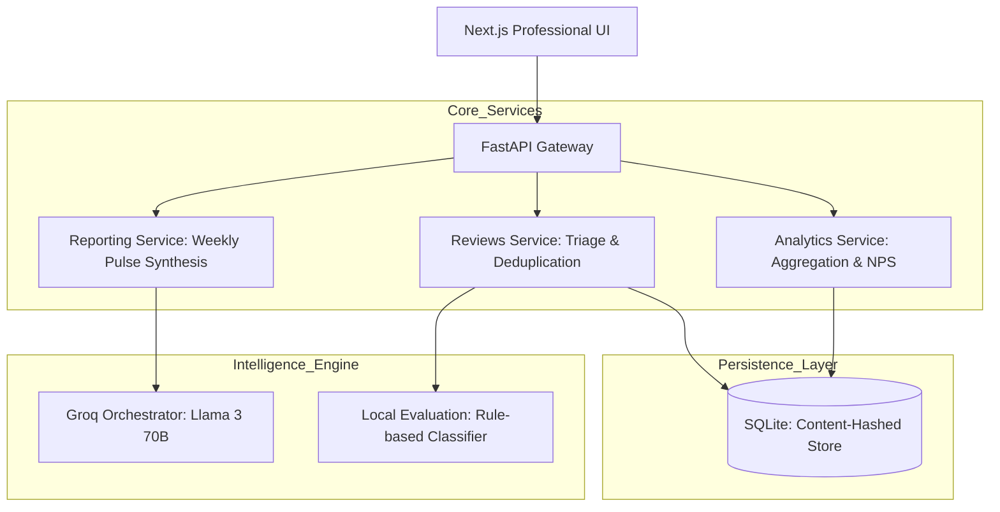

# INDMoney Product Intelligence Platform: System Architecture

This document defines the unified, production-grade architecture for the INDMoney **"Product Intelligence Platform"**. It governs the end-to-end transformation of massive-scale App Store and Google Play feedback into actionable strategic insights and real-time engineering triage.

---

## 1. Core Objective
The platform automates the lifecycle of user feedback, converting **10,000+ reviews** into a **Decision Intelligence Hub** used by Product, Engineering, and Growth teams to:
*   **Real-time Triage**: Directly assign critical feedback to PMs (Sai, Jeeth, Ram, Tech).
*   **Analytics Hub**: Monitor high-fidelity sentiment, rating distributions, and NPS signals.
*   **Trend Intelligence**: Track multi-quarter product health over a **1-12 month strategic window**.
*   **Executive Reporting**: Synthesize **Monthly, Quarterly, and Annual** stakeholder notes and action plans using Groq (Llama 3).

---

## 2. High-Level Architecture

The system follows a modular, service-oriented architecture designed for scale and observability.

---

## 3. The 6-Layer Intelligence Model

1.  **Ingestion Layer**: Multi-adapter adapters for Google Play and Apple App Store. Handles normalization, and a **Rolling Lookback** mechanism. The system dynamically calculates the analysis window using `datetime.now()`, ensuring that a 30-day pulse always captures the most recent 30 days of data relative to the generation timestamp.
2.  **Identity Layer**: Real-name attribution for public reviewers, with high-fidelity unique handle generation (e.g., `Google User #D93B`) for anonymous signals.
3.  **Triage Layer**: Content-based deduplication (Content-Hash + Platform) and functional classification (App Crash, UX Issues, Charges & Fees, etc.).
4.  **Analytics Layer**: Multi-dimensional aggregation of rating distributions, sentiment momentum, and NPS-style indicators.
5.  **Synthesis Layer**: AI-driven theme extraction and executive summary generation using the Groq LLM pipeline.
6.  **Interface Layer**: Premium **Light Theme** dashboard with precision drill-downs from aggregate KPIs to raw feedback evidence.
7.  **Education Layer**: Proactive financial literacy integration. Anchors strategic pulses to real-world INDMoney product benchmarks (e.g., SBI PSU Direct Growth, ICICI Infrastructure) by providing fact-checked fee explainers (Exit Load, Brokerage) accompanied by verified source links.

---

## 4. System Scaling & Data Constraints

| Metric | Capacity | Rationale |
| :--- | :--- | :--- |
| **Max Capacity** | 10,000 reviews | Support high-volume multi-platform products |
| **Historical Window**| 360 Days (1 Year) | Deep multi-quarter strategic trend analysis |
| **Ingestion Limit** | 5,000 per platform | Balanced representation of Android vs iOS |
| **Reporting Standard**| Vector-Safe Text | **Elite 2-Page Standard**: Section headers are sanitized (emoji-free) to ensure 100% legibility and character-safety across all stakeholder devices. |
| **Deduplication** | Content-Hash | Prevent redundant signal noise in reports |

---

## 5. Database Schema (filtered_reviews)

| Column | Type | Purpose |
| :--- | :--- | :--- |
| `user_name` | TEXT | Real name or unique handle (Real Identity) |
| `review_text` | TEXT | Primary feedback content |
| `rating` | INTEGER | Numeric score (1-5) |
| `sentiment` | TEXT | AI/Local classified mood (Positive/Neutral/Negative) |
| `category` | TEXT | Functional bucket (Performance/App Crash/Support/etc.) |
| `platform` | TEXT | Source platform (android/ios) |
| `app_version` | TEXT | Version-specific signal tracking |
| `content_hash` | TEXT | UNIQUE key for deduplication (text + platform) |
| `assigned_to` | TEXT | Ownership tracking (Sai, Jeeth, Ram, Tech, Tech Team) |

---

## 6. UI/UX Design System (Professional Light Theme)

### **Intelligence Hub (Analytics)**
*   **Interactive KPI Strips**: Clickable metrics (Pos/Neg/NPS) that route directly to the filtered review feed.
*   **Category Health Grid**: Status-aware cards (**Good / Needs Attention / Critical**) for functional buckets.
*   **Precision Navigation**: Anchor-based drill-down (`#review-feed`) for frictionless evidence investigation.

### **Unified Triage (Reviews)**
*   **High-Density Feed**: Streamlined "paper-like" interface optimized for rapid scanning of thousands of reviews.
*   **Contextual Side Drawer**: Slide-out panel for deep review analysis and manual PM assignment.
*   **Signal Filtering**: Integrated Search + Sentiment + Platform + Category matrix.

---

## 7. Assignment Framework

| Category Bucket | Default PM | Team Alignment |
| :--- | :--- | :--- |
| Onboarding / KYC | Sai | Growth & Conversion |
| UI / UX / App Flow | Jeeth | Platform Experience |
| Payments / Payouts | Ram | Fintech & Operations |
| Performance / Security| Tech | Core Infrastructure |
| App Crash / Bugs | Tech Team | Engineering Reliability |

---

### **Executive Synthesis & One-Page Note**
The platform features an automated **Pulse Generation Engine** that synthesizes raw signal data into a high-impact executive summary:
*   **One-Page Strategic Note**: Automatically generates the **Top 3 Themes** (percentage-based), **3 Golden User Quotes** (direct voice of customer), and **3 Actionable Product Ideas** for the selected time window (30D to 360D).
*   **Approval & Multi-Channel Delivery**: A unified "Approve & Sync" workflow that simultaneously:
    1.  **Drafts Leadership Email**: Prepares a tailored note for stakeholders (PMs, Leadership).
    2.  **Appends to Google Workspace**: Uses **MCP (Model Context Protocol)** to push the strategic note directly into a shared Google Doc for persistent knowledge tracking.
    3.  **PDF Archival**: Generates a high-fidelity report record for historical reference.

---

## 10. Phase-wise Development Roadmap
The system has evolved through five strategic phases:
*   **Phase 1: Ingestion Foundation**: Basic scraper setup for Android/iOS and data normalization.
*   **Phase 2: Intelligence Pipeline**: Integration of Groq (Llama 3) for theme extraction and executive summaries.
*   **Phase 3: Stakeholder Reporting**: Automated email delivery and MCP-driven Google Doc archiving.
*   **Phase 4: Decision Dashboard**: Migration to Next.js with the professional Unified Intelligence Hub.
*   **Phase 5: Scale & Parity**: Expansion to 360-day historical window and real-user identity attribution.

---

## 11. Success Metrics
*   **Triage Efficiency**: Signal identification to PM assignment in **< 10 seconds**.
*   **Historical Clarity**: 100% visibility into seasonal sentiment shifts over a **360-day** window.
*   **Accountability**: Every "Detractor" or "Critical" signal mapped to a responsible owner.
